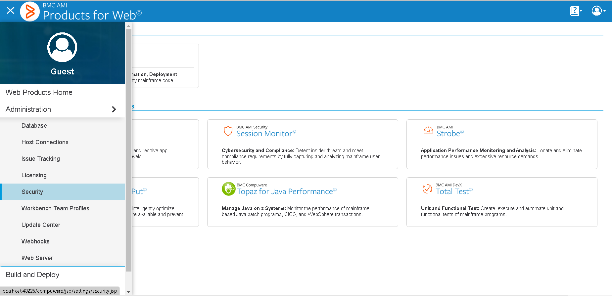

# ispw-deploy

The ispw-deploy action allows your GitHub Actions workflow to trigger a deploy in your instance of BMC Compuware ISPW on the mainframe. This action can be used in scenarios where your mainframe source is stored in Git, or when you want your GitHub Actions workflow to operate on source that is already stored in ISPW.

## Example usage

The following example will automatically retrieve the deploy parameters from a previous step in the job

``` yaml
on: [push]

jobs:
  run-ispw-generate-deploy:
    runs-on: ubuntu-latest
    name: A job to sync git source into ISPW, then deploy it on the mainframe
    steps:
      - name: Sync step
        uses: bmc-compuware/ispw-sync@v20.6.1.gtk
        id: sync
        with:
          host: 'host.example.com'
          port: 37733
          uid: ${{ secrets.TSOUSER }}
          pass: ${{ secrets.TSOPASS }}
          runtimeConfiguration: 'ISPW'
          stream: 'PLAY'
          application: 'PLAY'
          checkoutLevel: 'DEV2'
          gitUid: 'admin'
          gitPass: ${{ secrets.GITPASS }}
          showEnv: true
      - name: Generate
        uses: bmc-compuware/ispw-generate@v1
        id: generate
        with:
          ces_url: 'https://CES:48226/'
          ces_token: ${{ secrets.CES_TOKEN }}
          srid: 'host-37733'
          runtime_configuration: 'ISPW'
          generate_automatically: ${{ steps.sync.outputs.automaticBuildJson }}
      - name: Get the number of generate failures
        run: echo "The number of generate failures is ${{ steps.generate.outputs.generate_failed_count }}"
      - name: Deploy
        uses: bmc-compuware/ispw-deploy@v1
        id: deploy
        with:
          ces_url: 'https://CES:48226/'
          ces_token: ${{ secrets.CES_TOKEN }}
          srid: 'host-37733'
          runtime_configuration: 'ISPW'
          deploy_automatically: ${{ steps.sync.outputs.automaticBuildJson }}
```

The following example will deploy two specific ISPW tasks within assignment PLAY000826

``` yaml
on: [push]

jobs:
  run-ispw-deploy:
    runs-on: ubuntu-latest
    name: A job to deploy in ISPW
    steps:
      - name: Deploy
        uses: bmc-compuware/ispw-deploy@v1
        id: deploy
        with:
          ces_url: "https://CES:48226/"
          ces_token: ${{ secrets.CES_TOKEN }}
          srid: host-37733
          runtime_configuration: ISPW
          assignment_id: PLAY000826
          level: DEV1
          task_id: "7E3A5B274D24,7E3A5B274EFA"
      - name: Get the set ID for the deploy
        run: echo "The ISPW set used for the deploy is ${{ steps.deploy.outputs.set_id }}"
```

## Inputs

| Input name | Required | Description |
| ---------- | -------- | ----------- |
| `ces_url` | Required | The URL to use when connecting to CES |
| `ces_token` | Required | The token to use when authenticating the request to CES |
| `srid` | Required | The SRID of the ISPW instance to connect to |
| `change_type` | Optional | The change type of this request. The default value is 'S' for standard. |
| `execution_status` | Optional | The flag to indicate whether the deploy should happen immediately, or should be held. The default is 'I' for immediate. Other possible value is 'H' for hold. |
| `runtime_configuration` | Optional | The runtime configuration for the instance of ISPW you are connecting to. |
| `deploy_automatically` | Optional | A string of JSON that contains the parameters for the deploy. If using an ispw-sync step before the deploy, this JSON string can be retrieved from the outputs of that step. If `deploy_automatically` is not being used, then the `assignment_id`, `level`, and `task_id` must be specified. |
| `assignment_id` | Optional | The assignment for which you intend to deploy tasks. Do not use if `deploy_automatically` has already been specified. |
| `level` | Optional | The level that the tasks exist at in the assignment. Do not use if `deploy_automatically` has already been specified. |
| `task_id` | Optional | The comma-separated string of task IDs for the tasks that need to be deployd. Do not use if `deploy_automatically` has already been specified. |

## Outputs

| Output name | Output type | Description |
| ----------- | ----------- | ----------- |
| `set_id` | string | The ID of the set that was used for processing. |
| `url` | string | The URL that can be used to retrieved information about the set that was used for processing. |

## Setup

### Create a token in CES

In order to use this action, you must access an instance of the BMC Compuware CES product. You will need to open CES in your web browser and create a token to be used during CES requests. To set up a new host connection, go to the hamburger menu in the upper left corner and select Host Connections.



On the Host Connection Settings page, click "Add." Set up the host connection to be used for ISPW and click OK when finished.

Then, go back to the menu and select Security. On the Security page, click Add and the Personal Access Token dialog will come up.


On the Personal Access Token dialog, select the host that you want to create a token for, and enter in the mainframe username and password.

Once done, there will be a new token in the table on the Security page


### Save the token as a GitHub Secret

From the Security page in CES, copy the token. In GitHub go to Settings > Secrets and click the button for New Repository Secret.


On the New Secret page, paste the token that was copied earlier and click the Add secret button. Make a note of the name you give the secret so that you can easily use it in your workflow script.


### Fill in the workflow script

Use the examples above to fill in a workflow script using the ispw-deploy action. Note that if you want the input assignment, level, and taskIds to be automatically picked up from the ISPW synchronization with Git, you will need synchronization step in your job, which will run before the deploy.

### Troubleshooting

To enable debug logging in your GitHub actions workflow, see the guide [here](https://docs.github.com/en/actions/managing-workflow-runs/enabling-debug-logging).


